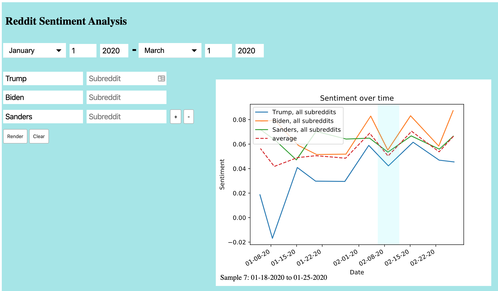
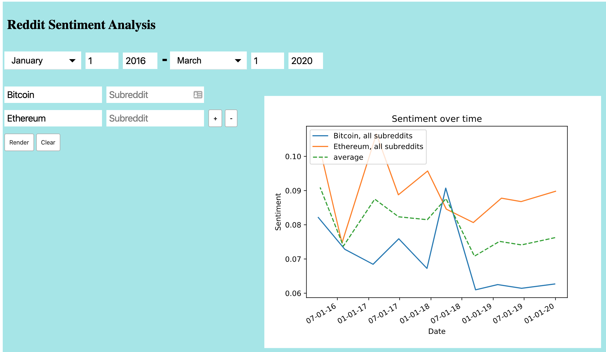

# Reddit Sentiment Analysis

Billions of opinions at your fingertips in seconds!

Enter any number of queries for terms or subreddits, and see the trend
of how positively or negatively those words are used in reddit comments
over a given timeframe

To run, just run `python3 app.py` in the terminal, and then navigate to 
`localhost:5000` in your browser (optimized for Chrome)

You will need to install flask and textblob, and use the following command
`python -m textblob.download_corpora` for textblob dependancies

## How it works

The main architecture is a localhost website with a python and flask backend. 
When requested, it uses threading to make a request to the pushshift API 
to gather data from reddit, and textblob to analyze its sentiment. The status
of the second thread is dislayed in real time on the site until all queries
have been loaded, then page loads the data visualized with matplotlib
and made interactive with various JavaScript features.

## Example Usages

#### Polling data

#### Financial data

## Authors

Lee Conway, Cal Poly  
Ben Lucero, Pitzer  
Theo Bayard de Volo, Pitzer  
Julian Rice, Cal Poly  

(all can be found under the Contributers tab)

Created for SLO Hacks 2020
